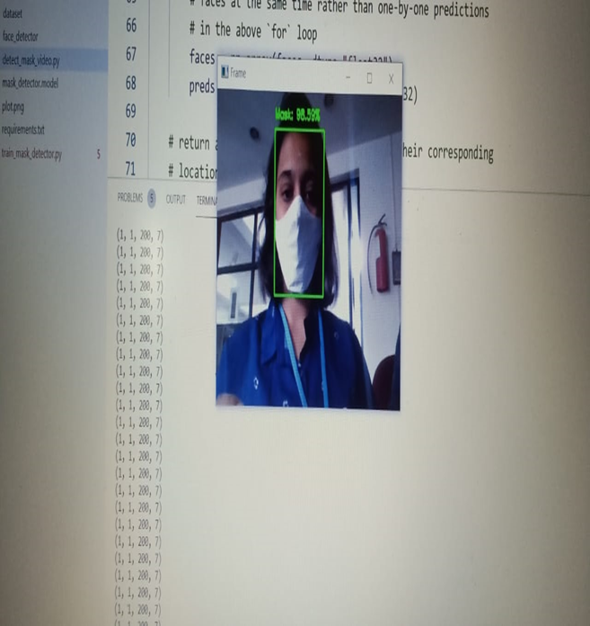
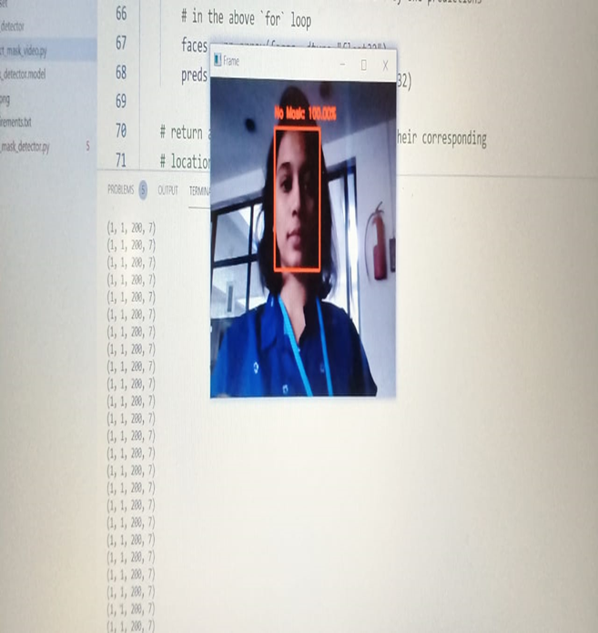
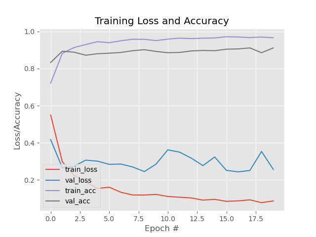

# Face Mask Detection System

## Overview

The Face Mask Detection System is a Machine Learning and Computer Vision application that detects whether a person is wearing a face mask in real time using a webcam feed.

The project was developed during the COVID-19 pandemic to help monitor mask compliance in public environments. The system detects faces from video frames and classifies them as **Mask** or **No Mask** using a trained deep learning model.

---

## Problem Statement

Wearing face masks became one of the primary preventive measures during the COVID-19 pandemic. Monitoring mask compliance manually in public places is difficult and inefficient.

This project aims to automate mask detection by analyzing live video streams and identifying whether individuals are wearing masks.

---

## Features

* Real-time face detection
* Face mask classification
* Webcam-based monitoring
* Deep learning-based prediction
* Fast and lightweight implementation
* Live visualization of predictions

---

## Technologies Used

* Python
* OpenCV
* TensorFlow
* Keras
* NumPy

---

## Project Structure

```text
face_detector/
│
├── deploy.prototxt
├── res10_300x300_ssd_iter_140000.caffemodel

detect_mask_video.py
train_mask_detector.py
mask_detector.model
requirements.txt

Mask_Output.png
No_mask_Output.png
plot.png
```

---

## How It Works

1. Capture video stream from webcam.
2. Detect faces using OpenCV's Deep Learning Face Detector.
3. Extract face regions from each frame.
4. Preprocess the detected faces.
5. Pass the face image to the trained mask detection model.
6. Classify the face as:

   * Mask
   * No Mask
7. Display the prediction result in real time.

---

## Results

### Person Wearing Mask

The system successfully detects individuals wearing face masks and classifies them correctly during real-time webcam monitoring.



### Person Not Wearing Mask

The system accurately identifies individuals who are not wearing face masks and labels them as "No Mask" in real time.



### Training Performance

The model demonstrated strong learning performance during training. Training accuracy increased steadily and reached approximately **97%**, while validation accuracy remained around **90%**, indicating good generalization on unseen data. Training and validation losses decreased over time, showing effective model convergence.



---

## Applications

* Public safety monitoring
* Offices and workplaces
* Hospitals and healthcare facilities
* Educational institutions
* Smart surveillance systems

---

## Future Improvements

* Improve accuracy using larger datasets
* Detect multiple faces simultaneously
* Add alert and notification mechanisms
* Integrate CCTV monitoring support
* Deploy as a web or mobile application

---

## Author

* Madupally Homamalini

---

## License

This project was developed as part of the Bachelor of Engineering (Information Technology) Mini Project at Vasavi College of Engineering.
